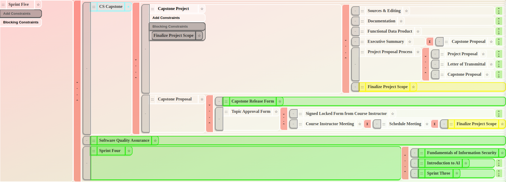

# Interplan
Interplan is a work-in-progress web app created to interactively track tasks, their status, and their dependencies. The primary goal of Interplan is to continuously present a to-do list of actionable tasks, rather than a mixture of tasks that are and aren't actionable. This offers the secondary goal of asynchronously producing, tracking, and consuming tasks across a large and unorganized group of people, acting as a sort of inter-person planning and scheduling service. An ideal use case might be when many people are helping cook thanksgiving dinner - actionable tasks are automatically presented as their dependencies are marked complete.

# Project Status
Interplan is currently a prototype tool for my personal use. There are foundational features, efficiencies, and safeties which would be necessary for 'alpha' use. The current version of Interplan exists primarily to support exploring how to configure future versions, what tools & features are most important, and whether Neo4J is capable of supporting those future versions and features vs other or custom databases.

This repo functions as a portfolio entry.

# Back-End Design
- React Webpage
- Javascript Interplan API in the browser
  - Busy-waiting for updates
  - Forwards updates to relevant listeners
- Interplan API generates Cypher queries in the browser
- Neo4J Database

# Front-end Design
This screenshot shows the current display language of Interplan, taken during my capstone project at WGU.

